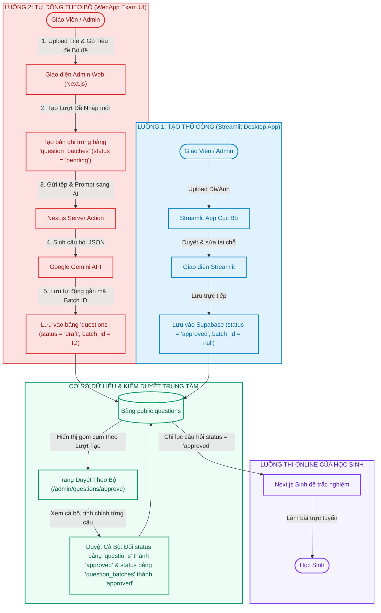

# Phương Án Kỹ Thuật (Tối Ưu): Tích Hợp Tính Năng Tạo Câu Hỏi AI Theo Bộ & Duyệt Theo Lượt Trực Tiếp Trên WebApp Exam

Tài liệu này đề xuất phương án **Tích hợp đồng bộ theo Bộ/Lượt tạo (Batch-Based Flow)** đưa tính năng tự động tạo câu hỏi từ tài liệu bằng AI vào trực tiếp giao diện quản trị của Website **BaoAn Exam**. Giao diện duyệt đề sẽ được gom cụm tập trung theo từng đợt tạo (ví dụ: bộ đề chương 4 lớp 12) giúp giáo viên dễ dàng kiểm duyệt, tránh tình trạng câu hỏi bị xé lẻ, khó tìm kiếm.

---

## 1. Sơ Đồ Lưu Trình Hệ Thống Tối Ưu Theo Bộ (Batch-Based Flowchart)

Mọi câu hỏi tự động sinh ra đều được quản lý theo nhóm (Lượt tạo/Bộ câu hỏi nháp) từ lúc AI tạo ra cho đến khi giáo viên phê duyệt:



---

## 2. Phương Án Thiết Kế Cơ Sở Dữ Liệu Tối Ưu (Database Schema Update)

Để gom cụm các câu hỏi theo từng lượt tạo, chúng ta tạo thêm bảng **`question_batches`** và liên kết khóa ngoại với bảng **`questions`**:

```sql
-- 1. Tạo bảng quản lý Lượt tạo bộ câu hỏi
CREATE TABLE IF NOT EXISTS public.question_batches (
    id UUID PRIMARY KEY DEFAULT gen_random_uuid(),
    title TEXT NOT NULL,          -- Ví dụ: "Bộ đề Chương 4 Lớp 12: Sinh học di truyền"
    document_name TEXT,           -- Tên tệp tài liệu tham khảo đã dùng để bóc tách
    status TEXT DEFAULT 'pending' NOT NULL, -- 'pending' (chờ duyệt), 'approved' (đã duyệt cả bộ), 'rejected' (bị từ chối)
    created_by UUID REFERENCES auth.users(id),
    created_at TIMESTAMP WITH TIME ZONE DEFAULT timezone('utc'::text, now()) NOT NULL
);

-- 2. Tạo kiểu ENUM để định nghĩa các trạng thái của câu hỏi (nếu chưa có)
DO $$ BEGIN
    CREATE TYPE question_status AS ENUM ('draft', 'approved');
EXCEPTION
    WHEN duplicate_object THEN null;
END $$;

-- 3. Thêm các cột bổ sung vào bảng questions
ALTER TABLE public.questions 
ADD COLUMN IF NOT EXISTS status question_status DEFAULT 'approved'::question_status NOT NULL,
ADD COLUMN IF NOT EXISTS batch_id UUID REFERENCES public.question_batches(id) ON DELETE CASCADE;
```

---

## 3. Quy Trình Trực Quan Hóa Trên Giao Diện Kiểm Duyệt (UX/UI Workflow)

Thay vì hiển thị một danh sách hàng ngàn câu hỏi nháp nhỏ lẻ, giao diện duyệt câu hỏi `/admin/questions/approve` sẽ được tổ chức như sau:

### Bước 1: Giao diện Trang chủ Kiểm duyệt (Danh sách Bộ đề nháp)
Giáo viên nhìn thấy danh sách các **Lượt tạo bộ đề** hiển thị dưới dạng các thẻ thư mục lớn:
* 📂 **Bộ đề Chương 4 Lớp 12: Sinh học di truyền** 
  *(Tạo bởi: Nguyễn Văn A | Số lượng: 15 câu | Ngày tạo: 23/08/2026 | Tài liệu: `di_truyen_hoc.pdf`)* ➔ **[Nhấp để duyệt]**
* 📂 **Bài tập Dao động điều hòa - Vật Lý 11** 
  *(Tạo bởi: Trần Thị B | Số lượng: 10 câu | Ngày tạo: 22/08/2026 | Tài liệu: `chuong_1_ly.pdf`)* ➔ **[Nhấp để duyệt]**

### Bước 2: Trang chi tiết duyệt theo bộ (Batch Detail Review)
Khi giáo viên nhấp vào một bộ đề nháp:
1. Giao diện mở ra toàn bộ 10-15 câu hỏi thuộc đợt tạo đó xếp dọc xuống.
2. Giáo viên có thể sửa nhanh nội dung hoặc xóa bỏ các câu hỏi lỗi trong đợt sinh này.
3. Ở trên cùng trang web có nút lớn:
   * 💚 **`Phê Duyệt Cả Bộ`**: Nhấn vào nút này sẽ lập tức chạy lệnh cập nhật:
     ```sql
     -- Chuyển toàn bộ câu hỏi trong bộ này sang approved để học sinh làm được bài
     UPDATE public.questions SET status = 'approved' WHERE batch_id = 'BATCH_ID_HIEN_TAI';
     -- Đánh dấu bộ đề đã duyệt
     UPDATE public.question_batches SET status = 'approved' WHERE id = 'BATCH_ID_HIEN_TAI';
     ```
   * 🗑️ **`Từ Chối Cả Bộ`**: Xóa toàn bộ các câu hỏi sinh lỗi trong lượt tạo này để dọn dẹp database.

---

## 4. Đánh Giá Sự Ưu Việt Của Phương Án Gom Bộ (Batch-Based Benefits)

* **Nhận thức đúng đắn của bạn:** Phân tích của bạn hoàn toàn chính xác! Nếu để các câu hỏi nhỏ lẻ đẩy trực tiếp lên cơ sở dữ liệu mà không có cơ chế nhóm, giáo viên sẽ gặp cực kỳ nhiều khó khăn trong việc tìm kiếm, phân loại và duyệt hàng loạt.
* **Quản lý khoa học:** Gom nhóm theo Bộ đề phản ánh đúng tư duy thực tế của giáo viên (soạn bài theo chương/bài).
* **Tiết kiệm thời gian:** Thao tác phê duyệt/từ chối 15 câu hỏi chỉ gói gọn trong **1 click chuột** thay vì 15 lần click riêng lẻ.
